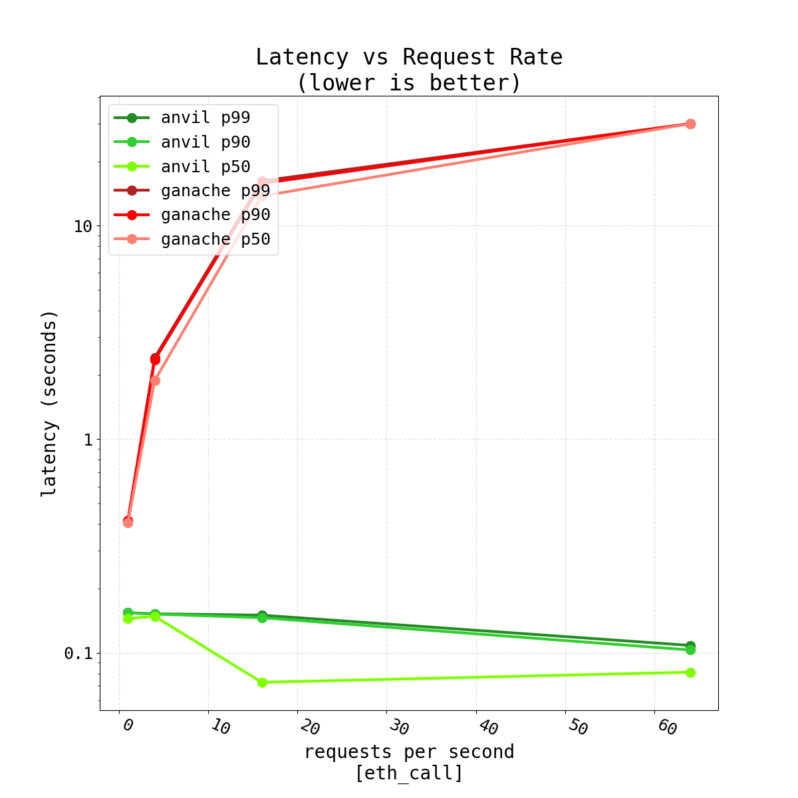
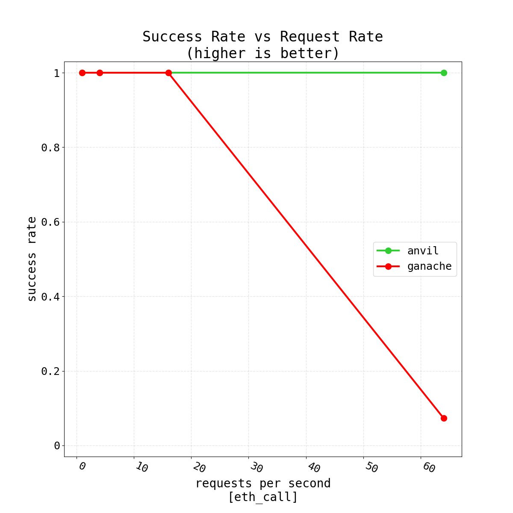
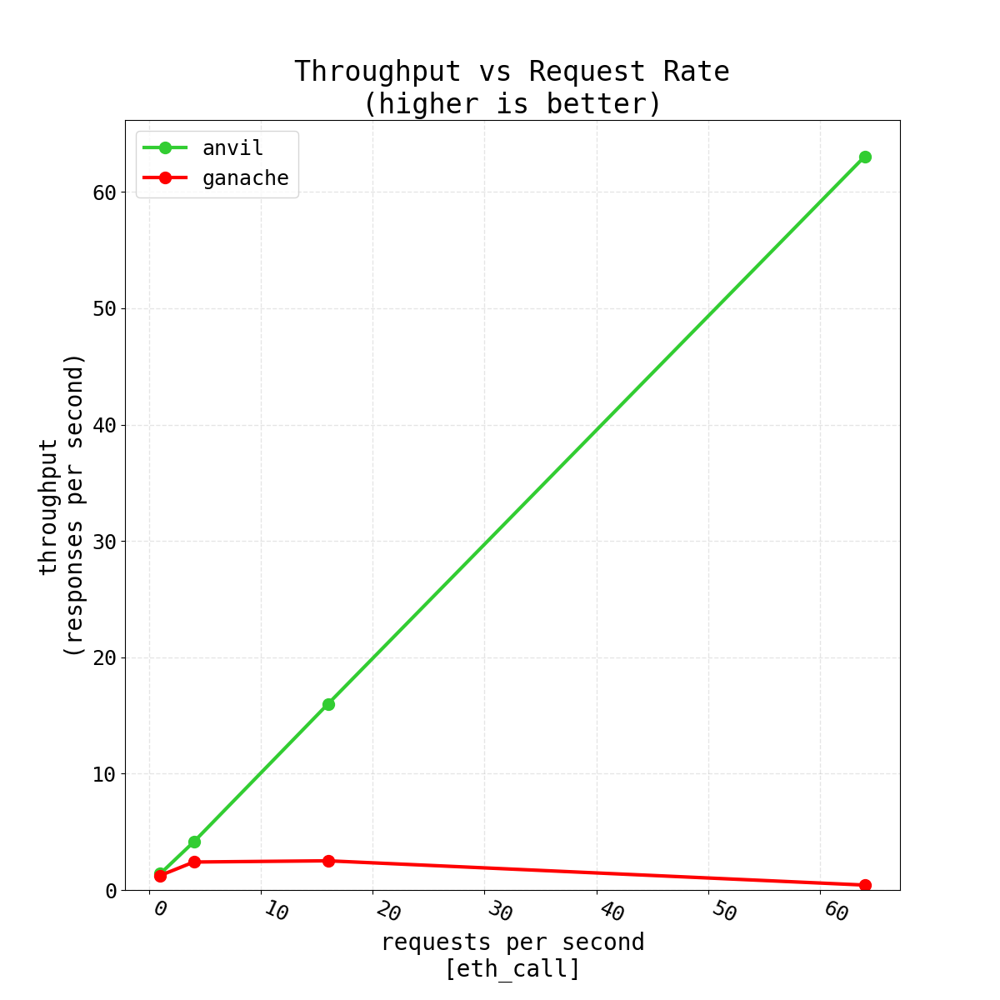

# Ganache vs Anvil Benchmarks for Forking Polygon

## Introduction

In this repo you will find the comparison done through [flood](https://github.com/paradigmxyz/flood) for comparing performance / reliability of forking through ganache vs anvil

## Results





## Methodology

```
flood eth_call anvil=localhost:3000 ganache=localhost:8545 -o ./fork-benchmarks/benchmarks/eth_call -d 3 --rates 1 4 16 64
```

## Considerations

My Dockerfiles may have not been optimized, and Ganache kept crashing during the benchmark, so I just ran them locally on my machine so I could get these results.

Tried using Alpine for the Ganache image, but it didn't have the uWS native module ganache depended on, so I moved to a a standard Node.js image `node:latest` that's based on Debian and had glibc
